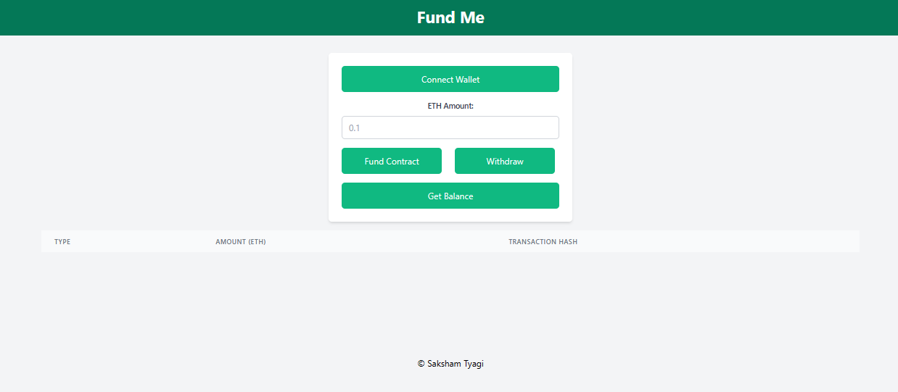

        # FundME frontend
        ================
        

 # Fundme Project

Welcome to the Fundme project! This project aims to create a crowdfunding platform using Ethereum blockchain and Hardhat for smart contract development.

## Installation

1. **Node.js and npm**: Make sure you have Node.js and npm installed on your system. You can download and install them from [Node.js website](https://nodejs.org/).

2. **Hardhat**: Install Hardhat globally by running the following command:
- npm install -g hardhat

3. **Clone Repository**: Clone this repository to your local machine:
- git clone <repository-url> 
- cd fundme-project

4. **Install Dependencies**: Install project dependencies using npm:

## Smart Contract Development

1. **Create Smart Contract**: Write your smart contract code in `contracts/` directory. You can use Solidity language for writing smart contracts.

2. **Compile Contracts**: Compile your smart contracts using Hardhat:
- npx hardhat compile

3. **Write Tests**: Write tests for your smart contracts in `test/` directory. Hardhat provides a testing environment for writing and running tests.

4. **Run Tests**: Execute your tests using Hardhat:
- npx hardhat test

## Deployment

1. **Configure Deployment**: Configure your deployment settings in `hardhat.config.js` file. Specify network settings, accounts, and other deployment parameters.

2. **Deploy Contracts**: Deploy your smart contracts to the Ethereum blockchain using Hardhat
- npx hardhat run scripts/deploy.js --network <network-name>

Replace `<network-name>` with the desired network (e.g., `rinkeby`, `mainnet`, etc.).

3. **Interact with Contracts**: After deployment, you can interact with your contracts using Ethereum wallets like MetaMask or programmatically through web3.js or ethers.js.

   

